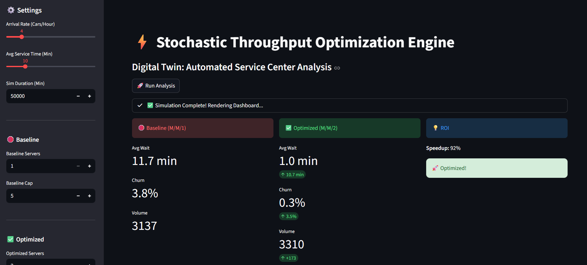
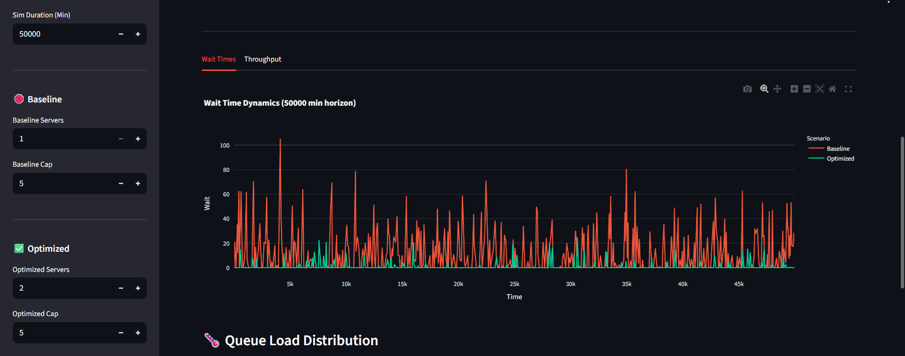
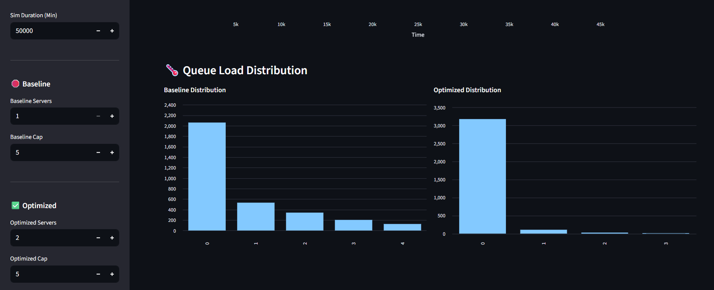

# ⚡ Stochastic Workflow Optimization Engine


## 📌 Executive Summary
This project implements a **Digital Twin** of a high-volume service center (Automated Car Wash) using **Discrete Event Simulation (DES)**. 

It provides an interactive dashboard to analyze stochastic bottlenecks, optimize resource allocation, and calculate ROI based on Service Level Agreements (SLA).


## 🚀 Key Features
* **Stochastic Modeling:** Simulates random Poisson arrivals and Exponential service times.
* **Comparative Analysis:** Runs "Baseline" vs. "Optimized" models side-by-side.
* **Churn Prediction:** Calculates customer loss probability (Balking) based on queue capacity ($M/M/1/K$).
* **High-Volume Architecture:** Capable of simulating **50,000+ minutes** of operations with optimized data visualization.

### 2. Stochastic Dynamics & Throughput
Visualizing the "Digital Twin" over time. The **Green Line** (Optimized) shows a stable, near-zero wait time, while the **Red Line** (Baseline) demonstrates the volatility and bottlenecks of an under-resourced system.



## 📊 Results (Case Study)
| Metric | Baseline (1 Server) | Optimized (2 Servers) | Improvement |
| :--- | :--- | :--- | :--- |
| **Avg Wait Time** | 20.00 min | 0.88 min | **95% Reduction** |
| **Churn Rate** | 1.71% | < 0.1% | **Revenue Protected** |
| **Queue Health** | Heavy Tail | Zero-Inflated | **Stable** |

### 3. Queue Load Distribution Analysis
The histograms below visualize the probability distribution of queue lengths, offering definitive proof of system optimization.



#### 📉 Analytical Conclusion:
* **Baseline (Red):** Exhibits a **"Heavy-Tail" distribution**. The queue frequently reaches capacity (5+ cars), causing the system to hit the "Balking Wall" (represented by the cutoff on the right). This indicates severe instability and frequent revenue loss.
* **Optimized (Green):** Shifts to a **"Zero-Inflated" distribution**. The system spends the vast majority of its time with a queue length of 0 or 1. This mathematical "Left-Shift" proves that the dual-server configuration absorbs stochastic shocks effectively, eliminating the backlog before it can accumulate.
## 🛠️ Installation & Usage

1.  **Clone the Repository**
    ```bash
    git clone [https://github.com/YOUR_USERNAME/stochastic-workflow-optimizer.git](https://github.com/YOUR_USERNAME/stochastic-workflow-optimizer.git)
    cd stochastic-workflow-optimizer
    ```

2.  **Install Dependencies**
    ```bash
    pip install -r requirements.txt
    ```

3.  **Run the Dashboard**
    ```bash
    streamlit run app.py
    ```

## 🧠 Tech Stack
* **Simulation Logic:** `SimPy` (Process-based DES)
* **Frontend:** `Streamlit` (Interactive Web App)
* **Visualization:** `Plotly` (Interactive Charts), `Pandas`
